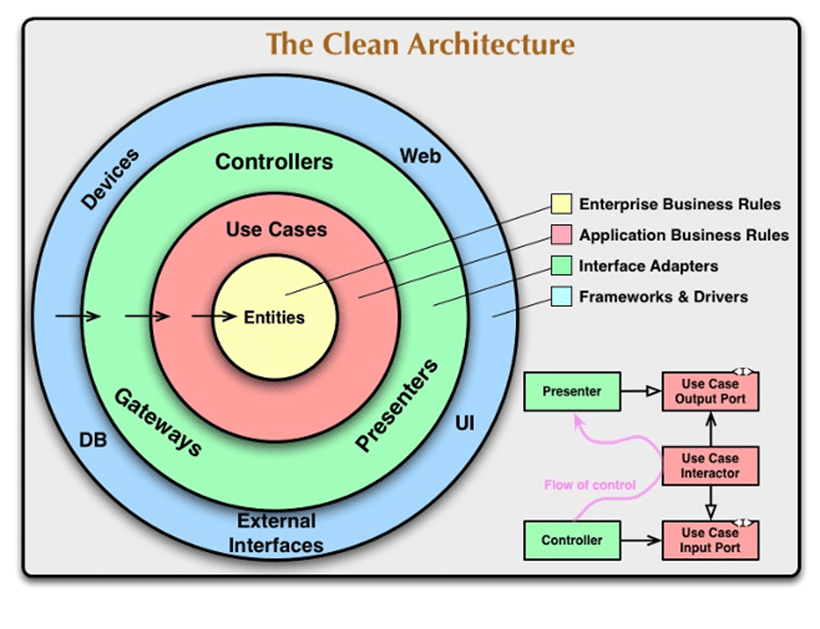

# Clean Architecture + Ports and Adapters with Reactjs

This is a project made with the intention of applying the concepts of Clean
Architecture and Ports and Adapters in a front-end application, as in most cases
we see these concepts being applied only on the backend. Furthermore, some
programming principles and design patterns were used to make the code more
readable, flexible and resilient.

Summary:

- [System Requirements Specification](#system-requirements-specification)
- [Layers](#layers)
- [Domain Layer](#domain-layer)
- [Application Layer](#application-layer)
- [Infrastructure Layer](#infrastructure-layer)
- [User Interface Layer](#user-interface-layer)
- [Dependency Rule](#dependency-rule)
- [Principles](#principles)
- [Design Patterns](#design-patterns)
- [Git, CI, CD](#git-ci-cd)
- [References](#references)

## [System Requirements Specification](#system-requirements-specification)

- the system must have screens: home, employee registration, list of employees,
  employee update, account registration and login
- home
  - should show a generic welcome message if the user is not logged in
  - should show a welcome message with the name of the logged in user
- employee registration
  - must contain the fields: name, salary, document (cpf/cnpj) and email
  - the form must be validated only when it is sent
  - field error messages should appear below each field
  - when registering an employee, it should show a success message and reset all
    the fields
  - if a connection error occurs, it should show an error message
  - should clear field error message when change
- employee update
  - the fields must initially be filled in with the selected employee's data
  - must contain the fields: name, salary, document (cpf/cnpj) and email
  - the form must be validated only when it is sent
  - field error messages should appear below each field
  - when updating employee, it should notify user and redirect to list page
  - if a connection error occurs, it should show an error message
  - should clear field error message when change
- list of employees
  - should show a list of all registered employees, without pagination
  - the list must contain the following employee data: name, salary, document
    (cpf/cnpj) and email
  - each line of the list must have update and delete buttons
  - when delete, should automatically update list
  - when an error occurs while deleting, should rollback list state
  - update button should redirect to employee update screen
- Create an account
  - the user must inform name, email, password and confirm the password
  - at the end of the registration, the user should be logged in automatically
    and redirected to home
  - the form fields must be validated when they lose the focus state
- Login
  - the user must inform email and password to perform the login
  - the form fields must be validated when they lose the focus state
  - when logging in, the user must be redirected to the home

## [Layers](#layers)

- User Interface -> react files, components, views, pages.
- Infrastructure -> drivers, adapters, repository implementation, libs,
  formatters, implementations in general.
- Application -> use cases, models, dtos, services, repository/ports interfaces.
- Domain -> business rules interfaces, validations, entities, value objects.

## [Domain Layer](#domain-layer)

At the center is the domain layer. It is the entities and data that describe the
subject area of the application, as well as the code to transform that data. The
domain is the core that distinguishes one application from another.

You can think of the domain as something that won't change if we move from React
to Angular, or if we change some use case.

The data structure of domain entities and the essence of their transformations
are independent from the outer world. External events trigger domain
transformations, but do not determine how they will occur.

## [Application Layer](#application-layer)

Around the domain is the application layer. This layer describes use cases, i.e.
user scenarios. They are responsible for what happens after some event occurs.

Also, in the application layer there are ports, the specifications of how our
application wants the outside world to communicate with it. Usually a port is an
interface, a behavior contract.

Ports serve as a “buffer zone” between our application's wishes and the reality.
Input Ports tell us how the application wants to be contacted by the outside
world. Output Ports say how the application is going to communicate with the
outside world to make it ready.

## [Infrastructure Layer](#infrastructure-layer)

This layer is responsible to implement the Interface Contracts defined within
the application layer to the Secondary Actors as Adapters. Infrastructure Layer
supports other layers by implementing the abstractions and integrations to
3rd-party library and systems.

Infrastructure layer contains most of your application’s dependencies on
external resources such as file systems, web services, third party APIs, and so
on. The implementation of services should be based on interfaces defined within
the application layer.

Converts data from data layers to use case or entity layers.

## [User Interface Layer](#user-interface-layer)

This layer is also called as Presentation. Presentation Layer contains the UI
elements (pages, components, routes) of the application. It handles the
presentation (UI, API, etc.) concerns. This layer is responsible for rendering
the Graphical User Interface (GUI) to interact with the user. It is the
application entry-point.

User Interface layer depends on both the Application and Infrastructure layers,
however, **the dependency on Infrastructure is only to support dependency
injection**. This layer can use any library or framework, like React, Angular or
Vue.

Note that the farther we are from the center, the more “service-oriented” the
code functionality is, the farther it is from the domain knowledge of our
application. This will be important later on, when we decide which layer any
module should belong to.

## [Dependency Rule](#dependency-rule)

Only the outer layers can depend on the inner layers.

- the domain must be independent.
- the application layer can depend on the domain.
- the infrastructure layer can depend on anything except on ui layer.
- the user interface layer can depend on anything.

<i>remember to use the dependency inversion principle to avoid coupling between
layers</i>

Sometimes this rule can be violated, although it is better not to abuse it. For
example, it is sometimes convenient to use some “library-like” code in a domain,
even though there should be no dependencies. In this repository we are using
yupjs lib on the domain layer to validate our entities.

## [Principles](#principles)

- Single Responsibility Principle
- Open Closed Principle
- Liskov Substitution Principle
- Dependency Inversion Principle
- Don't Repeat Yourself
- You Aren't Gonna Need It
- Keep It Simple, Stupid

## [Design Patterns](#design-patterns)

- Factory
- Adapter
- Decorator
- Composite

## [Git, CI, CD](#git-ci-cd)

- Branch protection
- Pull request template
- Codewoners
- Conventional Commits
- Github Actions
- SonarQube and SonarCloud

## [References](#references)

- https://bespoyasov.me/blog/clean-architecture-on-frontend/
- https://medium.com/dotnet-hub/clean-architecture-with-dotnet-and-dotnet-core-aspnetcore-overview-introduction-getting-started-ec922e53bb97
- https://www.youtube.com/watch?v=kCSiGeUFi_U&t=1955s&ab_channel=RodrigoBranas
- https://www.youtube.com/watch?v=iUQVZHzqGuc&t=1681s&ab_channel=Mango
- https://martinfowler.com/articles/gateway-pattern.html
- http://wiki.c2.com/?FourLayerArchitecture
- https://alistair.cockburn.us/hexagonal-architecture/
- https://blog.cleancoder.com/uncle-bob/2012/08/13/the-clean-architecture.html
